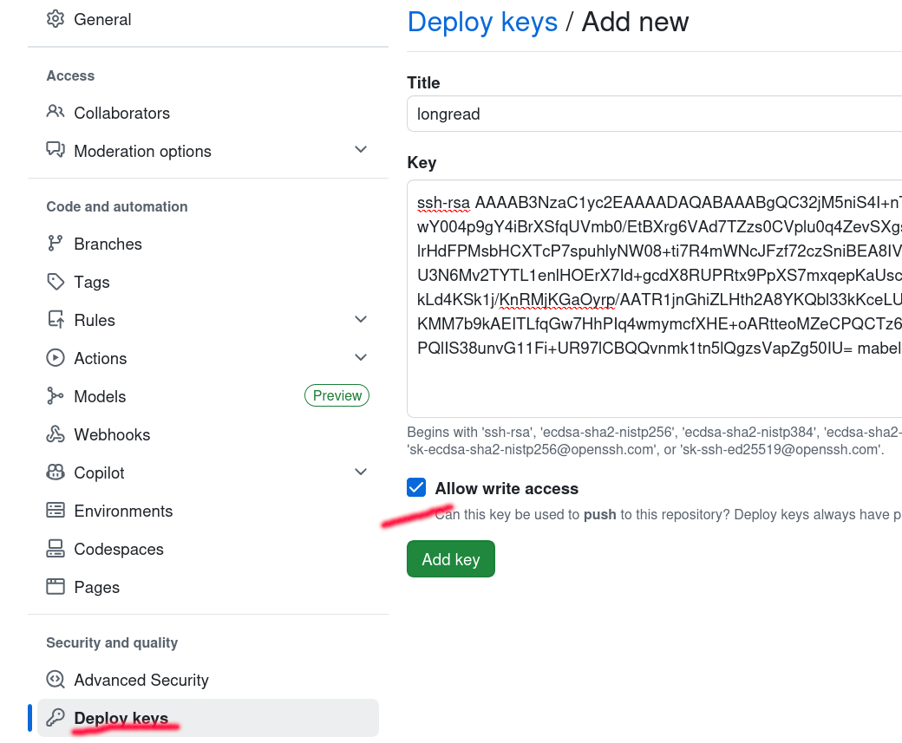
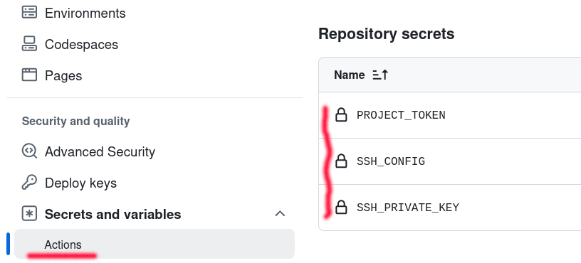

# Singularity — шаблон для лонгридов с виджетами

Код, написанный с помощью данного шаблона, легко превратить в отдельно стоящий сайт с хостингом на `Github pages`. Он основан на фреймворке `svelte` с расширением `mdx`, позволяющем писать тексты с применением синтаксиса `markdown` и встраивать в него интерактивные `js`-виджеты, которые могут быть основаны на синтаксисах:

* `mermaid`;
* `d3`;
* `svg`.

Конечно же, можно вставлять картинки в растровых форматах.

***

Построение сайта производится удаленно, на стороне `Github`. Для того, чтобы `workflow` работал корректно, нужно произвести следующие настройки.

* сгенерировать пару `ssh`-ключей; 
* публичный ключ поместить в раздел `Deploy keys`:



В раздел `Action secrets` нужно поместить:

* `SSH_PRIVATE_KEY` — закрытую часть того же `ssh`-ключа;
* `SSH_CONFIG` — конфигурацию подключения к `ssh`-серверу, скопировать туда следующий фрагмент:

```
Host gh
	HostName github.com
	User git
	IdentityFile ~/.ssh/longread
```

* `PROJECT_TOKEN` — токен, сформированный в разделе `Developer Settings` разделаа персональных настроек (**не настроек проекта**).



ВНИМАНИЕ! Эти настройки нужно выполнить раньше, чем будет сделан первый `push` в удаленный репозиторий.

После этого сделать коммит и через пару минут перейти на страницу проекта по адресу `https://GITHUB_USER_NAME.github.io/PROJECT_NAME`.
